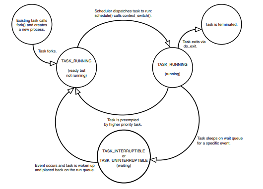

* [Process](#process)
* [Threads](#threads)
* [Scheduling](#scheduling)

---

# Process 
- A process is a program (object code stored on some media) in the midst of execution.
- Processes are, however, more than just the executing program code (often called the text
section in Unix).They also include a set of resources such as open files and pending signals,
internal kernel data, processor state, a memory address space with one or more memory
mappings, one or more threads of execution, and a data section containing global variables.
- Processes, in effect, are the living result of running program code.The kernel needs to
manage all these details efficiently and transparently.

- A process is usually defined as an instance of a program in execution; thus,
if 16 users are running vi at once, there are 16 separate processes (although they
can share the same executable code). 

- Processes are often called tasks or threads

- kernel's point of view, the purpose of a process is to act as an entity to
which system resources (CPU time, memory, etc.) are allocated
- A process begins its life when, not surprisingly, it is created. In Linux, this occurs by
means of the fork() system call, which creates a new process by duplicating an existing
one.

<details>
  <summary><strong>What is a process?</strong></summary>

> - a program loaded into memory
> - identified by a process id, commonly
abbreviated as pid
> - owns resources:
    - memory, including
code and data
    - open files
    - identity - user id, group id
    - timers and more
> - Resources owned by one process are protected
from other processes
</details>

## Process Types
- The process that calls fork() is the parent, whereas the new process is the child.The
parent resumes execution and the child starts execution at the same place: where the call
to fork() returns.The fork() system call returns from the kernel twice: once in the parent process and again in the newborn child.
Often, immediately after a fork it is desirable to execute a new, different program.
- The
exec() family of function calls creates a new address space and loads a new program into
it. In contemporary Linux kernels, fork() is actually implemented via the clone() system call,
Finally, a program exits via the exit() system call.This function terminates the process
and frees all its resources.
- parent process can inquire about the status of a terminated
child via the wait4()1 system call, which enables a process to wait for the termination of
a specific process.When a process exits, it is placed into a special zombie state that represents terminated processes until the parent calls wait() or waitpid()

- When a process is created, it is almost identical to its parent. It receives a (logical)
copy of the parent's address space and executes the same code as the parent,
beginning at the next instruction following the process creation system call.
Although the parent and child may share the pages containing the program code
(text), they have separate copies of the data (stack and heap), so that changes by
the child to a memory location are invisible to the parent (and vice versa).

- a chronological thread (the computer follows a single path through the code, no other paths run at the same time), and a set of resources
allocated to the application — for example, memory, files, and so on. New processes are generated using
the fork and exec system calls:
  - fork generates an identical copy of the current process; this copy is known as a child process. All
resources of the original process are copied in a suitable way so that after the system call there
are two independent instances of the original process. These instances are not linked in any way
but have, for example, the same set of open files, the same working directory, the same data in
memory (each with its own copy of the data), and so on.3
  - exec replaces a running process with another application loaded from an executable binary file.
In other words, a new program is loaded. Because exec does not create a new process, an old
program must first be duplicated using fork, and then exec must be called to generate an additional application on the system.

### Process Descriptor
- To manage processes, the kernel must have a clear picture of what each process is
doing. It must know, for instance, the process's priority, whether it is running on a
CPU or blocked on an event, what address space has been assigned to it, which
files it is allowed to address, and so on

- This is the role of the process descriptor —
a task_struct type structure whose fields contain all the information related to a
single process

- The process descriptor contains the data that describes the executing program—open files, the process’s address space,
pending signals, the process’s state, and much more

- The task_struct is a relatively large data structure, at around 1.7 kilobytes on a 32-bit
machine.This size, however, is quite small considering that the structure contains all the
information that the kernel has and needs about a process

- As the repository of so much information, the process descriptor
is rather complex. In addition to a large number of fields containing process
attributes, the process descriptor contains several pointers to other data structures
that, in turn, contain pointers to other structure

- The kernel stores the list of processes in a circular doubly linked list called the task list.Each element in the task list is a process descriptor of the type struct task_struct.

- struct structure is allocated via the slab allocator to provide object reuse and
cache coloring

- For each process, Linux packs two
different data structures in a single per-process memory area: a small data structure
linked to the process descriptor, namely the thread_info structure, and the
Kernel Mode process stack. The length of this memory area is usually 8,192 bytes
(two page frames).

-  that a process in
Kernel Mode accesses a stack contained in the kernel data segment, which is
different from the stack used by the process in User Mode. Because kernel control
paths make little use of the stack, only a few thousand bytes of kernel stack are
required. Therefore, 8 KB is ample space for the stack and the thread_info
structure. However, when stack and thread_info structure are contained in a single page frame, the kernel uses a few additional stacks to avoid the overflows
caused by deeply nested interrupts and exceptions.

###  Storing Process Descriptor
- The system identifies processes by a unique process identification value or PID.The PID is a
numerical value represented by the opaque type4 pid_t,which is typically an int, the default
maximum value is only 32,768 (that of a short int), although the value optionally can
be increased as high as four million (this is controlled in <linux/threads.h>.The kernel
stores this value as pid inside each process descriptor.
- This maximum value is important because it is essentially the maximum number of
processes that may exist concurrently on the system.Although 32,768 might be sufficient
for a desktop system, **large servers** may require many more processes. Moreover, the lower
the value, the sooner the values will wrap around, destroying the useful notion that higher values indicate later-run processes than lower values. If the system is willing to break compatibility with old applications, the administrator may increase the maximum value via
/proc/sys/kernel/pid_max. 

- **Inside the kernel**, tasks are typically referenced directly by a pointer to their
task_struct structure

- **As a general rule, each execution context that can be independently scheduled must have its own process descriptor**

- The strict one-to-one correspondence between the process and process descriptor
makes the 32-bit address of the task_struct structure a useful means for the
kernel to identify processes. These addresses are referred to as process descriptor
pointers. Most of the references to processes that the kernel makes are through
process descriptor pointers.

- On the other hand, Unix-like operating systems allow users to identify processes by
means of a number called the Process ID (or PID), which is stored in the pid field
of the process descriptor. PIDs are numbered sequentially: **the PID of a newly created process is normally the PID of the previously created process increased by one.** 

- there is an upper limit on the PID values; when the kernel reaches
such limit, it must start recycling the lower, unused PIDs. By default, the maximum
PID number is 32,767 (PID_MAX_DEFAULT - 1); the system administrator may
reduce this limit by writing a smaller value into the /proc /sys/kernel/pid_max file
(/proc is the mount point of a special filesystem)

- In 64-bit architectures, the system administrator can
enlarge the maximum PID number up to 4,194,303.

### Process State
- The state field of the process descriptor describes the current condition of the process. Each process on the system is in exactly one of five different states.This
value is represented by one of five flags
- these states are
mutually exclusive, and hence exactly one flag of state always is set; the
remaining flags are cleared. 

-  TASK_RUNNING — The process is runnable; it is either currently running or on a runqueue waiting to run.This is the only possible state for a process executing in user-space; it can also apply to a process in
kernel-space that is actively running.
    - Raising a hardware interrupt, releasing a system resource the process is waiting
for, or delivering a signal are examples of conditions that might wake up the
process (put its state back to TASK_RUNNING).
    - the main data structures of a runqueue are the lists of process
descriptors belonging to the runqueue; all these lists are implemented by a single
prio_array_t data structure

- TASK_INTERRUPTIBLE—The process is sleeping (that is, it is blocked) suspended, waiting for
some condition to exist.When this condition exists, the kernel sets the process’s
state to TASK_RUNNING.The process also awakes prematurely and becomes runnable
if it receives a signal

    

-  TASK_UNINTERRUPTIBLE—This state is identical to TASK_INTERRUPTIBLE except
that it does not wake up and become runnable if it receives a signal.This is used in
situations where the process must wait without interruption or when the event is
expected to occur quite quickly. Because the task does not respond to signals in
this state, TASK_UNINTERRUPTIBLE is less often used than TASK_INTERRUPTIBLE.
    -  For instance, this
state may be used when a process opens a device file and the corresponding
device driver starts probing for a corresponding hardware device. The device
driver must not be interrupted until the probing is complete, or the hardware
device could be left in an unpredictable state.

- __TASK_TRACED—The process is being traced by another process, such as a debugger, via ptrace.
    - Process execution has been stopped by a debugger. When a process is being
monitored by another (such as when a debugger executes a ptrace( ) system
call to monitor a test program), each signal may put the process in the
TASK_TRACED state

- __TASK_STOPPED—Process execution has stopped; the task is not running nor is it
eligible to run.This occurs if the task receives the SIGSTOP, SIGTSTP, SIGTTIN, or
SIGTTOU signal or if it receives any signal while it is being debugged.

Two additional states of the process can be stored both in the state field and in
the exit_state field of the process descriptor; as the field name suggests, a
process reaches one of these two states only when its execution is terminated:
- EXIT_ZOMBIE
Process execution is terminated, but the parent process has not yet issued a
wait4( ) or waitpid( ) system call to return information about the dead
process.
 Before the wait( )-like call is issued, the kernel cannot discard the
data contained in the dead process descriptor because the parent might need it.
- EXIT_DEAD
The final state: the process is being removed by the system because the parent
process has just issued a wait4( ) or waitpid( ) system call for it. Changing
its state from EXIT_ZOMBIE to EXIT_DEAD avoids race conditions due to other
threads of execution that execute wait( )-like calls on the same process

- The value of the state field is usually set with a simple assignment. For instance:
p->state = TASK_RUNNING;
The kernel also uses the set_task_state and set_current_state macros: they
set the state of a specified process and of the process currently executed,
respectively. Moreover, these macros ensure that the assignment operation is not
mixed with other instructions by the compiler or the CPU control unit. Mixing the
instruction order may sometimes lead to catastrophic results

### Wait queues
- Wait queues have several uses in the kernel, particularly for interrupt handling,
process synchronization, and timing. 
- a process must often wait for some event to occur,
such as for a disk operation to terminate, a system resource to be released, or a
fixed interval of time to elapse
- Wait queues implement conditional waits on
events: a process wishing to wait for a specific event places itself in the proper wait
queue and relinquishes control. 
- Therefore, a wait queue represents a set of sleeping
processes, which are woken up by the kernel when some condition becomes true.
- Wait queues are implemented as doubly linked lists whose elements include pointers to process descriptors. Each wait queue is identified by a wait queue head, a data structure of type `wait_queue_head_t`:

  ```c
  struct wait_queue_head {
    spinlock_t lock;
    struct list_head task_list;
  };
  typedef struct wait_queue_head wait_queue_head_t;
  ```
- Because wait queues are modified by interrupt handlers as well as by major kernel functions, the doubly linked lists must be protected from concurrent accesses, which could induce unpredictable results.
- Synchronization is
achieved by the lock spin lock in the wait queue head. The task_list field is the
head of the list of waiting processes.

- Elements of a wait queue list are of type wait_queue_t:
  ```c
    struct wait_queue {
      unsigned int flags;
      struct task_struct * task;
      wait_queue_func_t func;
      struct list_head task_list;
    };
    typedef struct wait_queue wait_queue_t;
  ```
- Each element in the wait queue list represents a sleeping process, which is waiting
for some event to occur; its descriptor address is stored in the task field. The
task_list field contains the pointers that link this element to the list of processes
waiting for the same event.
- However, it is not always convenient to wake up all sleeping processes in a wait
queue. For instance, if two or more processes are waiting for exclusive access to
some resource to be released, it makes sense to wake up just one process in the
wait queue
-  This process takes the resource, while the other processes continue to
sleep. (This avoids a problem known as the "thundering herd," with which multiple
processes are wakened only to race for a resource that can be accessed by one of
them, with the result that remaining processes must once more be put back to
sleep.)
- Thus, there are two kinds of sleeping processes: exclusive processes (denoted by
the value 1 in the flags field of the corresponding wait queue element) are
selectively woken up by the kernel, while nonexclusive processes (denoted by the
value 0 in the flags field) are always woken up by the kernel when the event
occurs. 
- A process waiting for a resource that can be granted to just one process at a
time is a typical exclusive process. Processes waiting for an event that may concern
any of them are nonexclusive. Consider, for instance, a group of processes that are
waiting for the termination of a group of disk block transfers: as soon as the
transfers complete, all waiting processes must be woken up.
- `Handling wait queues`A new wait queue head may be defined by using the
DECLARE_WAIT_QUEUE_HEAD(name) macro, which statically declares a new wait
queue head variable called name and initializes its lock and task_list fields. The
init_waitqueue_head( ) function may be used to initialize a wait queue head
variable that was allocated dynamically.
The init_waitqueue_entry(q,p ) function initializes a wait_queue_t
structure q as follows:
q->flags = 0;
q->task = p;
q->func = default_wake_function;
The nonexclusive process p will be awakened by default_wake_function( ),
which is a simple wrapper for the try_to_wake_up( )

- Alternatively, the DEFINE_WAIT macro declares a new wait_queue_t variable and
initializes it with the descriptor of the process currently executing on the CPU and
the address of the autoremove_wake_function( ) wake-up function. This
function invokes default_wake_function( ) to awaken the sleeping process,
and then removes the wait queue element from the wait queue list. Finally, a kernel
developer can define a custom awakening function by initializing the wait queue
element with the init_waitqueue_func_entry( ) function

- Once an element is defined, it must be inserted into a wait queue. The
add_wait_queue( ) function inserts a nonexclusive process in the first position
of a wait queue list. The add_wait_queue_exclusive( ) function inserts an
exclusive process in the last position of a wait queue list. The
remove_wait_queue( ) function removes a process from a wait queue list. The
waitqueue_active( ) function checks whether a given wait queue list is empty.

- A process wishing to wait for a specific condition can invoke any of the functions
shown in the following list.
The sleep_on( ) function operates on the current process:
```c
  void sleep_on(wait_queue_head_t *wq)
  {
    wait_queue_t wait;
    init_waitqueue_entry(&wait, current);
    current->state = TASK_UNINTERRUPTIBLE;
    add_wait_queue(wq,&wait); /* wq points to the wait queue head */
    schedule( );
    remove_wait_queue(wq, &wait);
  }
```
- The function sets the state of the current process to TASK_UNINTERRUPTIBLE
and inserts it into the specified wait queue. Then it invokes the scheduler, which
resumes the execution of another process. When the sleeping process is
awakened, the scheduler resumes execution of the sleep_on( ) function,
which removes the process from the wait queue.

- The interruptible_sleep_on( ) function is identical to sleep_on( ),
except that it sets the state of the current process to TASK_INTERRUPTIBLE
instead of setting it to TASK_UNINTERRUPTIBLE, so that the process also can be
woken up by receiving a signal.
- The sleep_on_timeout( ) and interruptible_sleep_on_timeout( )
functions are similar to the previous ones, but they also allow the caller to

### Relationships Among Processes

- Processes created by a program have a parent/child relationship. When a process
creates multiple children , these children have sibling relationships. Several fields
must be introduced in a process descriptor to represent these relationships
- Processes 0 and 1 are created
by the kernel
- process 1 (init) is the ancestor of all
other processes.
- Furthermore, there exist other relationships among processes: a process can be a
leader of a process group or of a login session , it can be a leader of a thread group,

- The pidhash table and chained lists
In several circumstances, the kernel must be able to derive the process descriptor
pointer corresponding to a PID. This occurs, for instance, in servicing the kill( )
system call. 
- When process P1 wishes to send a signal to another process, P2, it
invokes the kill( ) system call specifying the PID of P2 as the parameter. The
kernel derives the process descriptor pointer from the PID and then extracts the
pointer to the data structure that records the pending signals from P2's process
descriptor.
Scanning the process list sequentially and checking the pid fields of the process
descriptors is feasible but rather inefficient. To speed up the search, four hash
tables have been introduced. Why multiple hash tables? Simply because the process
descriptor includes fields that represent different types of PID, and
each type of PID requires its own hash table.
- All processes are descendants of the init process, whose PID is one.The kernel starts
init in the last step of the boot process.The init process, in turn, reads the system
initscripts and executes more programs, eventually completing the boot process.

- Every process on the system has exactly one parent. Likewise, every process has zero or
more children. Processes that are all direct children of the same parent are called siblings.
The relationship between processes is stored in the process descriptor. Each task_struct
has a pointer to the parent’s task_struct, named parent, and a list of children, named children. Consequently, given the current process, it is possible to obtain the process
descriptor of its parent with the following code:
struct task_struct *my_parent = current->parent; 
- The init task’s process descriptor is statically allocated as init_task.A good example
of the relationship between all processes is the fact that this code will always succeed:
- struct task_struct *task;
for (task = current; task != &init_task; task = task->parent)
;
/* task now points to init */
In fact, you can follow the process hierarchy from any one process in the system to any
other. Oftentimes, however, it is desirable simply to iterate over all processes in the system.
This is easy because the task list is a circular, doubly linked list.To obtain the next task in
the list, given any valid task, use
list_entry(task->tasks.next, struct task_struct, tasks)
Obtaining the previous task works the same way:
list_entry(task->tasks.prev, struct task_struct, tasks)
These two routines are provided by the macros next_task(task) and
prev_task(task), respectively. Finally, the macro for_each_process(task) is provided,
which iterates over the entire task list. On each iteration, task points to the next task in
the list:
struct task_struct *task;
for_each_process(task) {
/* this pointlessly prints the name and PID of each task */
printk(“%s[%d]\n”, task->comm, task->pid);

- 

### Process Context
- One of the most important parts of a process is the executing program code.This code is
read in from an executable file and executed within the program’s address space.

-  Normal program execution occurs in user-space. When a program executes a system call or triggers an exception, it enters kernel-space.At this point, the
kernel is said to be “executing on behalf of the process” and is in process context.

- When in
process context, the current macro is valid Upon exiting the kernel, the process resumes
execution in user-space, unless a higher-priority process has become runnable in the
interim, in which case the scheduler is invoked to select the higher priority process.

- System calls and exception handlers are well-defined interfaces into the kernel.A
process can begin executing in kernel-space only through one of these interfaces—all
access to the kernel is through these interfaces.

- To control the execution of processes, the kernel must be able to suspend the
execution of the process running on the CPU and resume the execution of some
other process previously suspended

- This activity goes variously by the names
process switch, task switch, or context switch. The next sections describe the
elements of process switching in Linux.

- `Hardware Context` : While each process can have its own address space, all processes have to share the
CPU registers
-  So before resuming the execution of a process, the kernel must
ensure that each such register is loaded with the value it had when the process was
suspended
- The set of data that must be loaded into the registers before the process resumes its
execution on the CPU is called the hardware context . 
- The hardware context is a
subset of the process execution context, which includes all information needed for
the process execution. In Linux, a part of the hardware context of a process is
stored in the process descriptor, while the remaining part is saved in the Kernel
Mode stack.
- . We can thus define a process switch as the activity
consisting of saving the hardware context of prev and replacing it with the
hardware context of next
- Because process switches occur quite often, it is
important to minimize the time spent in saving and loading hardware contexts.
- While executing the instruction, the CPU performs a hardware context
switch by automatically saving the old hardware context and loading a new one.
But Linux 2.6 uses software to perform a process switch for the following reasons:
  - Step-by-step switching performed through a sequence of mov instructions allows
  better control over the validity of the data being loaded. In particular, it is
      possible to check the values of the ds and es segmentation registers, which
      might have been forged by a malicious user. This type of checking is not
      possible when using a single far jmp instruction.
  - The amount of time required by the old approach and the new approach is
about the same. However, it is not possible to optimize a hardware context
switch, while there might be room for improving the current switching code.
- Process switching occurs only in Kernel Mode. The contents of all registers used
by a process in User Mode have already been saved on the Kernel Mode stack
before performing process switching (see Chapter 4). This includes the contents of
the ss and esp pair that specifies the User Mode stack pointer address.

## Creating Process
- Most operating systems implement a spawn mechanism to create a new process in a new address space, `read in an executable, and begin executing it`.
-  Unix takes the unusual approach of separating these steps into two distinct
functions: fork()and exec().The first, fork(), creates a child process that is a copy of the current task. It differs from the parent only in its PID (which is unique), its PPID (parent’s PID, which is set to the original process), and certain resources and statistics, such as pending signals, which are not inherited.The second function, exec(), loads a new
executable into the address space and begins executing it.The combination of fork()followed by exec()is similar to the single function most operating systems provide.
- Unix operating systems rely heavily on process creation to satisfy user requests. For
example, the shell creates a new process that executes another copy of the shell
whenever the user enters a command.
- Traditional Unix systems treat all processes in the same way: resources owned by
the parent process are duplicated in the child process. This approach makes process
creation very slow and inefficient, because it requires copying the entire address
space of the parent process. The child process rarely needs to read or modify all
the resources inherited from the parent; in many cases, it issues an immediate
execve( ) and wipes out the address space that was so carefully copied.
- Modern Unix kernels solve this problem by introducing three different
mechanisms:
    - The Copy On Write technique allows both the parent and the child to read the same physical pages. Whenever either one tries to write on a physical page, the kernel copies its contents into a new physical page that is assigned to the writing process.
      - Traditionally, upon fork(), all resources owned by the parent are duplicated and the copy is given to the child.This approach is naive and inefficient in that it copies much data that might otherwise be shared.Worse still, if the new process were to immediately execute a new image, all that copying would go to waste. `In Linux, fork() is implemented through the use of copy-on-write pages. Copy-on-write (or COW) is a technique to delay or altogether prevent copying of the data`. Rather than duplicate the process address space, the parent and the child can share a single copy.
      - The data, however, is marked in such a way that if it is written to, a duplicate is made and each process receives a unique copy. Consequently, the duplication of resources occurs only when they are written; until then, they are shared read-only.This technique delays the copying of each page in the address space until it is actually written to. In the case that the pages are never written—for example, if exec() is called immediately after fork()—they never need to be copied.
      - The only overhead incurred by fork() is the duplication of the parent’s page tables and the creation of a unique process descriptor for the child. In the common case that a process executes a new executable image immediately after forking, this optimization prevents the wasted copying of large amounts of data (with the address space, easily tens of megabytes).This is an important optimization because the Unix philosophy encourages quick process execution.
    
    - Lightweight processes allow both the parent and the child to share many perprocess kernel data structures, such as the paging tables (and therefore the entire User Mode address space), the open file tables, and the signal dispositions.


    - The vfork( ) system call creates a process that shares the memory address space of its parent. To prevent the parent from overwriting data needed by the child, the parent's execution is blocked until the child exits or executes a new program. We'll learn more about the vfork( ) system call in the following section.

- `Forking` : Linux implements fork() via the clone() system call.This call takes a series of flags that
specify which resources, if any, the parent and child process should share.The
fork(), vfork(), and __clone() library calls all invoke the clone() system call with the
requisite flags.The clone() system call, in turn, calls do_fork().

- The bulk of the work in forking is handled by do_fork(), which is defined in
kernel/fork.c.This function calls copy_process() and then starts the process running.
The interesting work is done by copy_process():
  1. It calls dup_task_struct(), which creates a new kernel stack, thread_info structure, and task_struct for the new process.The new values are identical to those of the current task.At this point, the child and parent process descriptors are identical.
  2. It then checks that the new child will not exceed the resource limits on the number of processes for the current user.
  3. The child needs to differentiate itself from its parent.Various members of the process descriptor are cleared or set to initial values. Members of the process descriptor not inherited are primarily statistically information.The bulk of the values in task_struct remain unchanged.
  4. The child’s state is set to TASK_UNINTERRUPTIBLE to ensure that it does not yet run.
  5. copy_process() calls copy_flags() to update the flags member of the task_struct.The PF_SUPERPRIV flag, which denotes whether a task used superuser privileges, is cleared.The PF_FORKNOEXEC flag, which denotes a process that has not called exec(), is set.
  6. It calls alloc_pid() to assign an available PID to the new task.
  7. Depending on the flags passed to clone(), copy_process() either duplicates or shares open files, filesystem information, signal handlers, process address space, and namespace.These resources are typically shared between threads in a given process; otherwise they are unique and thus copied here.
  8. Finally, copy_process() cleans up and returns to the caller a pointer to the new child.

  - Back in do_fork(), if copy_process() returns successfully, the new child is woken up
  and run. Deliberately, the kernel runs the child process first.8 In the common case of the
  - child simply calling exec() immediately, this eliminates any copy-on-write overhead that
  would occur if the parent ran first and began writing to the address space.
 - vfork()
The vfork()system call has the same effect as fork(), except that the page table entries
of the parent process are not copied. Instead, the child executes as the sole thread in the
parent’s address space, and the parent is blocked until the child either calls exec() or exits.
The child is not allowed to write to the address space.This was a welcome optimization in
the old days of 3BSD when the call was introduced because at the time copy-on-write
pages were not used to implement fork().Today, with copy-on-write and child-runsfirst semantics, the only benefit to vfork() is not copying the parent page tables entries.
If Linux one day gains copy-on-write page table entries, there will no longer be any benefit.9 Because the semantics of vfork() are tricky (what, for example, happens if the
exec() fails?), ideally systems would not need vfork() and the kernel would not implement it. It is entirely possible to implement vfork() as a normal fork()—this is what
Linux did until version 2.2.
The vfork() system call is implemented via a special flag to the clone() system call:
1. In copy_process(), the task_struct member vfork_done is set to NULL.
2. In do_fork(), if the special flag was given, vfork_done is pointed at a specific
address.
3. After the child is first run, the parent—instead of returning—waits for the child to
signal it through the vfork_done pointer.
4. In the mm_release() function, which is used when a task exits a memory address
space, vfork_done is checked to see whether it is NULL. If it is not, the parent is signaled.
5. Back in do_fork(), the parent wakes up and returns.
If this all goes as planned, the child is now executing in a new address space, and the
parent is again executing in its orignal address space.


# Threads
- Threads of execution, often shortened to threads, are the objects of activity within the
process. 
- Each thread includes a unique program counter, process stack, and set of processor registers.
- The kernel schedules individual threads, not processes.To Linux, a thread is just a special kind of process
- threads share the virtual memory abstraction, whereas each
receives its own virtualized processor.
- user programs having many
relatively independent execution flows sharing a large portion of the application
data structures. In such systems, a process is composed of several user threads (or
simply threads), each of which represents an execution flow of the process.

- Linux uses lightweight processes to offer better support for multithreaded
applications. Basically, two lightweight processes may share some resources, like
the address space, the open files, and so on. Whenever one of them modifies a
shared resource, the other immediately sees the change. Of course, the two
processes must synchronize themselves when accessing the shared resource.

- A straightforward way to implement multithreaded applications is to associate a
lightweight process with each thread. In this way, the threads can access the same
set of application data structures by simply sharing the same memory address
space, the same set of open files, and so on; at the same time, each thread can be
scheduled independently by the kernel so that one may sleep while another remains
runnable. 
- POSIX-compliant multithreaded applications are best handled by kernels that
support "thread groups ." In Linux a thread group is basically a set of lightweight
processes that implement a multithreaded application and act as a whole with
regards to some system calls such as getpid( ) , kill( ) , and _exit( )

- Unix programmers expect threads in the same group to have a
common PID. For instance, it should be possible to a send a signal specifying a
PID that affects all threads in the group. In fact, the POSIX 1003.1c standard
states that **all threads of a multithreaded application must have the same PID**.

- To comply with this standard, Linux makes use of **thread groups**. The identifier
shared by the threads is the PID of the **thread group leader** , that is, the PID of the
first lightweight process in the group; it is stored in the tgid field of the process
descriptors. The getpid( ) system call returns the value of tgid relative to the
current process instead of the value of pid, so all the threads of a multithreaded
application share the same identifier. Most processes belong to a thread group
consisting of a single member; as thread group leaders, they have the tgid field
equal to the pid field, thus the getpid( ) system call works as usual for this kind
of proces.

- `At every process switch`, the hardware context of the process being replaced must
be saved somewhere. It cannot be saved on the TSS, as in the original Intel design,
because Linux uses a single TSS for each processor, instead of one for every
process.
Thus, each process descriptor includes a field called thread of type
thread_struct, in which the kernel saves the hardware context whenever the process is being switched out. As we'll see later, this data structure includes fields
for most of the CPU registers, except the general-purpose registers such as eax,
ebx, etc., which are stored in the Kernel Mode stack.

- A `process switch` may occur at just one well-defined point: the schedule( )
function, 
Essentially, every process switch consists of two steps:
  1. Switching the Page Global Directory to install a new address space;
  2. Switching the Kernel Mode stack and the hardware context, which provides
all the information needed by the kernel to execute the new process,
including the CPU registers.

- The second step of the process switch is performed by the switch_to macro. It is
one of the most hardware-dependent routines of the kernel, and it takes some
effort to understand what it does.
- The switch_to( ) function does the bulk of the process switch started by the
switch_to( ) macro. 

- `Kernel Threads` Traditional Unix systems delegate some critical tasks to intermittently running
processes, including flushing disk caches, swapping out unused pages, servicing
network connections, and so on. Indeed, it is not efficient to perform these tasks in
strict linear fashion; both their functions and the end user processes get better
response if they are scheduled in the background. Because some of the system
processes run only in Kernel Mode, modern operating systems delegate their
functions to kernel threads , which are not encumbered with the unnecessary User
Mode context. In Linux, kernel threads differ from regular processes in the
following ways:
    - Kernel threads run only in Kernel Mode, while regular processes run
alternatively in Kernel Mode and in User Mode.
Because kernel threads run only in Kernel Mode, they use only linear addresses
greater than PAGE_OFFSET. Regular processes, on the other hand, use all four
gigabytes of linear addresses, in either User Mode or Kernel Mode.

- It is often useful for the kernel to perform some operations in the background.The kernel accomplishes this via kernel threads—standard processes that exist solely in kernelspace.The significant difference between kernel threads and normal processes is that
kernel threads do not have an address space. (Their mm pointer, which points at their
address space, is NULL.) They operate only in kernel-space and do not context switch into
user-space. Kernel threads, however, are schedulable and preemptable, the same as normal
processes.
- Linux delegates several tasks to kernel threads, most notably the flush tasks and the
ksoftirqd task.You can see the kernel threads on your Linux system by running the command ps -ef.There are a lot of them! Kernel threads are created on system boot by
other kernel threads. Indeed, a kernel thread can be created only by another kernel
thread.The kernel handles this automatically by forking all new kernel threads off of the

<details>
  <summary><strong>What is a thread?</strong></summary>

> - a thread is a single flow of execution or
control
> -  a thread has some attributes:
• priority
• scheduling algorithm
• register set
• CPU mask for SMP
• signal mask
• and others
> - all its attributes have to do with running code
> - Threads run in a process:
– a process must have at least one thread
– threads in a process share all the process
resources **Threads run code, processes own resources**
</details>

- a thread is merely a process that shares certain resources with other processes.
Each thread has a unique task_struct and appears to the kernel as a normal process—
threads just happen to share resources, such as an address space, with other processe
- Threads are created the same as normal tasks, with the exception that the clone() system
call is passed flags corresponding to the specific resources to be shared:
clone(CLONE_VM | CLONE_FS | CLONE_FILES | CLONE_SIGHAND, 0);
The previous code results in behavior identical to a normal fork(), except that the
address space, filesystem resources, file descriptors, and signal handlers are shared. In other
words, the new task and its parent are what are popularly called threads.
In contrast, a normal fork() can be implemented as
clone(SIGCHLD, 0);
And vfork() is implemented as
clone(CLONE_VFORK | CLONE_VM | SIGCHLD, 0);
The flags provided to clone() help specify the behavior of the new process and detail
what resources the parent and child will share.

- It is often useful for the kernel to perform some operations in the background.The kernel accomplishes this via kernel threads—standard processes that exist solely in kernelspace.The significant difference between kernel threads and normal processes is that
kernel threads do not have an address space. (Their mm pointer, which points at their
address space, is NULL.) They operate only in kernel-space and do not context switch into
user-space. Kernel threads, however, are schedulable and preemptable, the same as normal
processes.
- Linux delegates several tasks to kernel threads, most notably the flush tasks and the
ksoftirqd task.You can see the kernel threads on your Linux system by running the command ps -ef.There are a lot of them! Kernel threads are created on system boot by
other kernel threads. Indeed, a kernel thread can be created only by another kernel
thread.The kernel handles this automatically by forking all new kernel threads off of the kthreadd kernel process.

# Scheduling
Processes provide two virtualizations: a virtualized
processor and virtual memory
- The virtual processor gives the process the illusion that it
alone monopolizes the system, despite possibly sharing the processor among hundreds of other processes
- Virtual memory lets the process allocate and manage memory as if it alone owned all the memory in the system (<a href="Memory_Management.md"><kbd>&emsp;Memory Management&emsp;</kbd></a> 
<br><br>)

