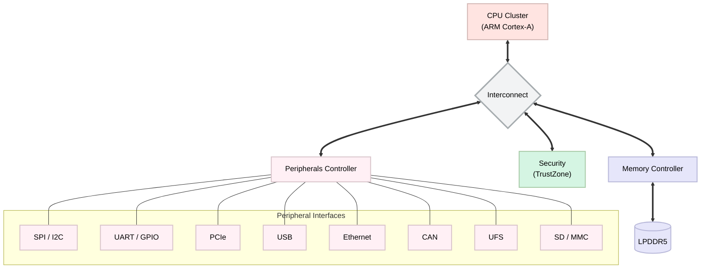

# Embedded Linux

---

🔹 Four Elements of Embedded Linux

1) **Toolchain**: The compiler and other tools needed to create code for your target device. Everything else depends on the toolchain.  

2) **Bootloader**: The program that initializes the board and loads the Linux kernel.  

3) **Kernel**: This is the heart of the system, managing system resources and interfacing with hardware.  

4) **Root filesystem**: Contains the libraries and programs that are run once the kernel has completed its initialization.  

---

**➕ One more element**  
A collection of programs specific to your embedded application which make the device do whatever it is supposed to do — be it weigh groceries, display movies, control a robot, or fly a drone.

---

🔹 Board Support Package (BSP)

- Board-specific **bootloader and initialization code**  
- **Device drivers**, **device tree**, and **configuration files**  
- Hardware-abstraction routines and static initialization scripts  

These BSP components are typically integrated into the kernel and root filesystem.

---

🔹 ARM SoC Comparison

| Feature | **TI AM3358 (BeagleBone Black)** | **Broadcom BCM2711 (Raspberry Pi 4)** |
|----------|----------------------------------|---------------------------------------|
| **Cortex Core** | Cortex-A8 | Cortex-A72 |
| **ARM Architecture** | ARMv7-A (32-bit) | ARMv8-A (64-bit, backward compatible with ARMv7) |
| **CPU Cores** | Single-core | Quad-core |
| **Clock Speed** | Up to 1 GHz | Up to 1.5 GHz |
| **Pipeline** | In-order, 13-stage | Out-of-order, superscalar |
| **NEON SIMD** | Supported | Supported (improved) |
| **Target Domain** | Embedded/industrial applications | General-purpose computing, multimedia, education |
| **GPU** | PowerVR SGX530 | Broadcom VideoCore VI (dual-core, 500 MHz) |
| **Memory** | 512 MB DDR3L | 1 GB / 2 GB / 4 GB / 8 GB LPDDR4 |
| **Storage** | microSD, 4 GB eMMC (on some models) | microSD slot |
| **Networking** | 10/100 Ethernet | Gigabit Ethernet, Wi-Fi 802.11ac, Bluetooth 5.0 |
| **USB** | USB 2.0 | USB 2.0 & USB 3.0 |
| **HDMI / Display** | LCD controller, no native HDMI | Dual micro-HDMI (4K supported) |
| **GPIO Pins** | 65+ (2×46-pin headers) | 40-pin header |
| **I/O Interfaces** | UART, SPI, I²C, CAN, PWM, ADC, PRU (Programmable Realtime Unit) | UART, SPI, I²C, GPIO, CSI (camera), DSI (display) |
| **Real-Time Support** | Yes (via PRUs, TI-RTOS, FreeRTOS, Zephyr, QNX, VxWorks) | Limited RTOS support, mainly Linux-focused |
| **OS Support** | Debian (BeagleBone images), Ångström, Yocto, Buildroot, Android (legacy), TI-RTOS, FreeRTOS | Raspberry Pi OS (32/64-bit), Ubuntu, Fedora, Arch, Manjaro, Android, LineageOS, Windows 10/11 ARM (community), BSD |
| **Power Requirement** | 5V DC input, lower power consumption | 5V via USB-C, higher power draw |
| **Use Cases** | Robotics, industrial control, automotive, embedded projects needing precise timing | General computing, multimedia, education, IoT, edge AI |

> ### Q. what the OS is actually controlling?
● CPU Architecture
● CPU pipeline
● Registers
● Privilege levels
● Exception levels
● Interrupts
● Timers
● MMU
● MPU
● Cache
● TLB
● Branch prediction
● Memory ordering
● Atomic instructions
● SIMD basics 
> ARM  
● ARMv7
● ARMv8-A
● AArch32
● AArch64
● Cortex-A architecture
● Cortex-R basics
● Cortex-M basics
● Exception levels
● EL0 / EL1 / EL2 / EL3
● Secure/Non-secure execution

> Other Architectures 
● RISC-V
● x86/x86-64
● PowerPC
● ARM vs RISC-V architecture comparison

> Memory Architecture  
● SRAM
● DRAM
● LPDDR
● LPDDR5
● HBM/HBM3
● Flash
● NOR/NAND
● Memory controllers
● Memory mapping
● Physical vs virtual memory
● Address translation
● Page tables
● TLB
● Memory attributes
● Cacheable/non-cacheable memory
● Memory barriers
● Memory ordering

> Cache & Coherency  
● L1/L2/L3 cache
● Cache lines
● Cache policies
● Write-back/write-through
● Cache coherency
● MESI/MOESI concepts
● SMP coherency
● DMA/cache interaction
● Interconnect
● Memory interleaving

> CPU subsystem  
● Memory subsystem
● Interconnect
● Peripheral subsystem
● Security subsystem
● Clock subsystem
● Reset subsystem
● Power subsystem
● DMA engines
● Interrupt controller
● Debug subsystem
● IP blocks
> ### Q. Bridge between AppDev space and kernelDev 
> Linux Fundamentals  
● Linux architecture
● Kernel vs user space
● System calls
● /proc
● /sys
● /dev
● /etc
● /var
● /tmp
● Permissions
● Users/groups
● Processes
● Signals

>Process Management 
● fork()
● execve()
● wait()
● waitpid()
● clone()
● Process IDs
● Parent/child processes
● Process lifecycle
● Process states
● Context switching
● Process descriptor/task structure

> Process Address Space 
● Text
● Data
● BSS
● Heap
● Stack
● Shared libraries
● mmap region
● Virtual address space

> Linux Concurrency & IPC 
> POSIX Threads 
● pthread_create
● pthread_join
● Thread lifecycle
● Thread attributes
● Thread scheduling
● Thread-local storage
● Thread synchronization

> Synchronization 
● Mutex
● Recursive mutex
● Condition variables
● Semaphores
● Read/write locks
● Spinlocks concept
● Atomic operations

> IPC 
● Pipes
● Named pipes
● POSIX message queues
● Shared memory
● POSIX semaphores
● Signals
● Unix domain sockets
● TCP/IP sockets
● Memory-mapped IPC

> Race Conditions 
● Race conditions
● Deadlocks
● Starvation
● Priority inversion
● Lock ordering
● Atomicity
● Memory barriers

> Linux File, Memory & VFS  
● File Systems
● File descriptors
● open
● read
● write
● close
● ioctl
● poll
● select
● epoll

> VFS  
● Virtual File System
● Inodes
● Dentries
● Superblocks
● Files
● File operations
● Mounting
● File system drivers

> Memory Management 
● malloc
● calloc
● realloc
● free
● mmap
● munmap
● mprotect
● mlock
● munlock
● Virtual memory
● Page faults
● Demand paging
● Shared memory
● Memory mapped files

> ### Q. Kernel 
> Kernel Architecture 
● Kernel/user boundary
● System calls
● Kernel subsystems
● Scheduler
● Memory management
● VFS
● Networking
● IPC
● Interrupt subsystem
● Driver subsystem

> Kernel Source Tree 
- arch/
- block/
- drivers/
- fs/
- include/
- init/
- ipc/
- kernel/
- mm/
- net/
- security/
- sound/
- tools/

> Kernel Build 
● Kernel configuration
● Kconfig
● menuconfig
● Defconfig
● Device configuration
● Kernel compilation
● Cross compilation
● Kernel image
● Image
● zImage
● uImage
● Modules

> Linux Kernel Modules 
● Kernel modules
● insmod
● rmmod
● modprobe
● lsmod
● Module parameters
● MODULE_LICENSE
● Init/exit functions
● Kernel logging
● printk
● pr_info
● pr_err
● Exported symbols
● EXPORT_SYMBOL
● Symbol dependencies
● Out-of-tree modules
● In-tree modules

> Kernel Concurrency 
● SMP architecture
● UP vs SMP
● CPU affinity
● Per-CPU data
● Context switching
● Preemption

> Kernel Synchronization 
● Atomic operations
● Spinlocks
● Mutexes
● Semaphores
● Read/write locks
● RCU
● Completion
● Wait queues
● Memory barriers
● Lockless programming

> ### Q. Linux Kernel Memory Mgmt
> Virtual Memory 
● Kernel virtual address space
● User virtual address space
● Page tables
● Page directories
● Address translation
● TLB
● Page faults

> Kernel Allocators 
● Buddy allocator
● SLAB
● SLUB
● kmalloc
● kzalloc
● vmalloc
● alloc_pages
● GFP flags
> Advanced Memory 
● DMA memory
● DMA mapping
● CMA
● Huge pages
● High memory
● Low memory
● Reserved memory
● IOMMU
● SMMU

> ### Linux Device Driver

> Linux Driver Model 
● Devices
● Drivers
● Buses
● Device matching
● Probe/remove
● struct device
● struct device_driver
● platform_driver
● Driver binding
● Sysfs
● Uevents
● Device model

> Character Drivers 
● Major/minor numbers
● cdev
● file_operations
● open
● read
● write
● ioctl
● poll
● mmap
● copy_to_user
● copy_from_user

> Block Drivers 
● Block layer
● Request queues
● BIO
● I/O scheduler
● Block device operations
● Storage drivers

> Network Drivers 
● Network device model
● net_device
● TX/RX
● NAPI
● SKBs
● Interrupt-driven networking
● DMA
● Ethernet MAC/PHY
● PHY framework

> Hardware Access in Drivers 
● MMIO
● ioremap
● readl
● writel
● Register programming
● Memory barriers
● Device side effects
● Resource management
● devm_*
● Reserved memory
● DMA
● DMA coherent memory
● Streaming DMA
● Scatter/gather DMA
● IOMMU
● SMMU
● Cache coherency

> ### Peripheral Driver 

> GPIO 
● GPIO controller
● GPIO descriptors
● Interrupt GPIO
● Pin control

> UART 
● Serial subsystem
● UART driver
● Console
● Baud rate
● Interrupt/DMA UART

> I2C 
● I2C architecture
● Master/slave
● i2c_adapter
● i2c_client
● I2C driver
● Device Tree integration
● Sensor driver

> SPI 
● SPI controller
● SPI device
● SPI driver
● Transfer mechanisms
● DMA SPI

> CAN 
● CAN architecture
● SocketCAN
● CAN controller
● CAN FD
● CAN driver

> USB Driver Development 
● USB architecture
● Host
● Device
● Hub
● Endpoint
● Interface
● Configuration
● Descriptors
● Control transfers
● Bulk transfers
● Interrupt transfers
● Isochronous transfers

> Linux USB 
● USB core
● Host controller
● xHCI
● EHCI concepts
● Gadget framework
● USB device drivers
● USB host drivers
● USB OTG
● USB PHY
● Runtime PM
● DMA

> PCI architecture 
● PCIe architecture
● Configuration space
● BARs
● Enumeration
● PCIe topology
● Root complex
● Endpoint
● MSI/MSI-X
● Interrupts
● DMA
● IOMMU
● PCIe link training
● ASPM
● AER
● Hotplug
● Power management

> Linux PCI Driver 
● pci_driver
● Probe/remove
● BAR mapping
● DMA
● MSI/MSI-X
● PCI configuration
● Error recovery

> Storage Architecture  
● Block layer
● Storage queues
● DMA
● Scatter/gather
● Interrupts
● Cache
● Performance optimization

> NVMe 
● NVMe architecture
● Submission queues
● Completion queues
● NVMe commands
● PCIe transport
● MSI-X
● DMA
● Linux NVMe driver

> UFS 
● UFS architecture
● UFS host controller
● UFS protocol
● SCSI layer
● UFS driver
● Power states
● Link management
● Error handling

> SD/MMC 
● SD architecture
● eMMC
● MMC subsystem
● SDHCI
● DMA
● Storage boot

> ### Q. Misc

> Display 
● DRM
● DRM/KMS
● Framebuffers
● Display controller
● Planes
● CRTC
● Connector
● Encoder
● Panel driver
● HDMI
● DisplayPort
● MIPI-DSI

> Camera 
● V4L2
● Camera sensors
● CSI-2
● MIPI CSI
● ISP
● V4L2 sub-devices
● Media controller
● Video capture
● Buffer management
● DMA

> Video 
● Video encoding
● Video decoding
● Hardware codecs
● GStreamer
● V4L2
● Zero-copy pipelines
● Buffer sharing
● Low-latency streaming

> Audio 
● ALSA
● ASoC
● I2S
● Audio codecs
● DSP
● PCM
● Audio routing
● PulseAudio
● PipeWire concepts

> Streaming 
● RTP
● RTSP
● UDP streaming
● TCP streaming
● Audio/video synchronization
● Low-latency pipelines

> Bluetooth 
● Bluetooth Classic
● Bluetooth Low Energy
● HCI
● L2CAP
● GATT
● GAP
● Profiles

> Linux Bluetooth 
● BlueZ
● Bluetooth kernel subsystem
● HCI drivers
● Bluetooth daemon
● Device pairing
● Audio profiles

> Wi-Fi 
● Wi-Fi drivers
● NetworkManager concepts
● Firmware loading
● SDIO/PCIe Wi-Fi
● Bluetooth/Wi-Fi coexistence

> Linux Middleware 
● BlueZ
● oFono
● OBEX
● PulseAudio
● ALSA

> Performance Analysis 
● CPU profiling
● Memory profiling
● I/O profiling
● Lock contention
● Scheduler latency
● Interrupt latency
● Context-switch overhead
● Cache misses
● DMA performance
● Network throughput
● Storage throughput

>Tools 
● perf
● ftrace
● trace-cmd
● eBPF basics
● /proc
● /sys
● vmstat
● iostat
● top
● htop
● iotop

> ### Pre-Silicon & Post-Silicon Development
> Pre-Silicon  
● QEMU
● FPGA platforms
● Zebu
● Simulation environments
● Virtual platforms
● Model-based validation
● Firmware simulation
● Binary analysis

> Post-Silicon 
● Board bring-up
● DDR validation
● Peripheral validation
● Boot validation
● JTAG debugging
● Trace analysis
● Hardware/software integration