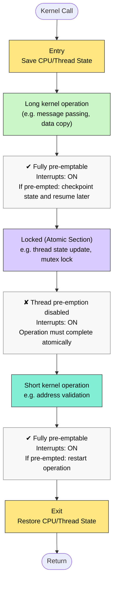

<a href="https://github.com/mohammed-hafeezkhn/ucontroller/blob/main/RealTimeOS/other/NeutrinoRTOS.md"><kbd>⬅ Back</kbd></a>

## [Neutrino_Architecture](#neutrino_architecture)
* QNX Neutrino delivers a standards based
system in a small form factor:
– POSIX 1003.1-2001
• Unix, threads, timers, signals, etc
– ANSI C/C++
• GNU Compiler Chain

- `Neutrino is a microkernel implementation of the core POSIX features used in embedded realtime systems, along with the fundamental QNX services.` 
- The POSIX features that aren't implemented in the microkernel (file and device I/O, for example) are provided by optional processes and shared libraries.

-  1003.1 -- defines the API for process management, device I/O, filesystem I/O, and basic IPC. This encompasses what might be described as the base functionality of a UNIX OS, serving as a useful standard for many applications. From a C-language programming perspective, ANSI X3J11 C is assumed as a starting point, and then the various aspects of managing processes, files, and tty devices are detailed beyond what ANSI C specifies.
- Realtime Extensions -- defines a set of realtime extensions to the base 1003.1 standard. These extensions consist of semaphores, prioritized process scheduling, realtime extensions to signals, high-resolution timer control, enhanced IPC primitives, synchronous and asynchronous I/O, and a recommendation for realtime contiguous file support.
- Threads -- further extends the POSIX environment to include the creation and management of multiple threads of execution within a given address space.
- Additional Realtime Extensions -- defines further extensions to the realtime standard. Facilities such as attaching interrupt handlers are described.
- Application Environment Profiles -- defines several AEPs (Realtime AEP, Embedded Systems AEP, etc.) of the POSIX environment to suit different embedded capability sets. These profiles represent embedded OSs with/without filesystems and other capabilities.

-  The primary goal of QNX is to deliver the open systems POSIX API in a robust, scalable form suitable for a wide range of systems -- from tiny, resource-constrained systems to high-end distributed computing environments.
- For mission-critical applications, a robust architecture is also fundamental, so the OS makes flexible and complete use of MMU hardware.

`note: The POSIX working groups explicitly defined the standards in terms of "interface, not implementation".`

- Despite its decidedly non-UNIX architecture, QNX implements the standard POSIX API. By adopting a microkernel architecture, QNX delivers this API in a form easily scaled down for realtime embedded systems or incrementally scaled up as required.

- developers using a microkernel OS can easily scale the system as needed -- by adding filesystems, networking, graphical user interfaces, and other technologies.

Some of the advantages to this scalable approach include:

   - portable application code (between product-line members)
   - common tools used to develop the entire product line
   - portable skill sets of development staff
   - reduced time-to-market.

- By building applications to the POSIX standards, developers can use OSs from multiple vendors. Application source code can be readily ported from platform to platform and from OS to OS, provided that developers avoid using OS-specific extensions.

### Why QNX for embedded systems?
- The main responsibility of an operating system is to manage a computer's resources. All activities in the system -- scheduling application programs, writing files to disk, sending data across a network, and so on -- should function together as seamlessly and transparently as possible.

- Some environments call for more rigorous resource management and scheduling than others. Realtime applications, for instance, depend on the OS to handle multiple events and to ensure that the system responds to those events within predictable time limits. The more responsive the OS, the more "time" a realtime application has to meet its deadlines.

- QNX is ideal for embedded realtime applications. It can be scaled to very small sizes and provides multitasking, threads, priority-driven preemptive scheduling, and fast context-switching -- all essential ingredients of an embedded realtime system. Moreover, QNX delivers these capabilities with a POSIX-standard API; there's no need to forgo standards in order to achieve a small OS.

- QNX is also remarkably flexible. Developers can easily customize the OS to meet the needs of their applications. From a "bare-bones" configuration of a microkernel with a few small modules to a full-blown network-wide system equipped to serve hundreds of users, QNX lets you set up your system to use only those resources you require to tackle the job at hand.

- QNX achieves its unique degree of efficiency, modularity, and simplicity through two fundamental principles:

   - microkernel architecture
   - message-based interprocess communication

### Microkernel architecture
- The Kernel it is the glue that holds the system together,programs deal with the kernel by using special library 
routines, called “kernel calls”, that execute code in the 
kernel
- Kernel calls are pre-emptable (can handle time critical events) 

- Kernel is core of your system 
                          process B
                         /
                        /
HW interrupts --> Kernel --> network stack --> network media
                         \ 
                          \
                           process A

`Kernel operations`:
> **Note**
>
> This is **not a time-ordered diagram**. These internal kernel states may be intermixed during a single kernel call.

### Behavior Summary

| Kernel state | Pre-emption | Interrupts | Behavior if pre-empted |
|---------------|-------------|------------|------------------------|
| Entry | Disabled briefly | Off | Save execution state |
| Long kernel operation | Yes | On | Checkpoint current state and continue later |
| Locked (atomic section) | No | On | Must complete atomically |
| Short kernel operation | Yes | On | Restart from the beginning |
| Exit | Disabled briefly | Off | Restore state and return |

### Notes

- **Long kernel operations** (for example, copying data during a message pass) are **checkpointable**. If pre-empted, the kernel saves their progress and resumes later.
- **Locked sections** protect very short atomic operations such as thread state changes or mutex manipulation. Thread pre-emption is temporarily disabled.
- **Short kernel operations** (for example, validating addresses for `MsgSend()`) are simply restarted after pre-emption because restarting is as cheap as checkpointing.
- A typical kernel call may transition through several of these states.
- Kernel entry and exit are architecture-specific and may use mechanisms such as software interrupts, `sysenter/sysexit`, `syscall/sysret`, or equivalent instructions.

- most of the other sub-systems, including user 
applications, communicate with each other using the 
message passing provided by the kernel through 
kernel calls

- A microkernel OS is structured as a tiny kernel that provides the minimal services used by a team of optional cooperating processes, which in turn provide the higher-level OS functionality. The microkernel itself lacks filesystems and many other services normally expected of an OS -- those services are provided by optional processes.

- The real goal in designing a microkernel OS is not simply to "make it small." A microkernel OS embodies a fundamental change in the approach to delivering OS functionality

- Modularity is the key, size is but a side effect.

- the IPC services provided by the microkernel are used to "glue" the OS itself together, the performance and flexibility of those services govern the performance of the resulting OS.

- The microkernel differs from an executive in how the IPC services are used to extend the functionality of the kernel with additional, service-providing processes. 

- Since the OS is implemented as a team of cooperating processes managed by the microkernel, user-written processes can serve both as applications and as processes that extend the underlying OS functionality for industry-specific applications

- The processes are separate from the kernel so if something goes 
wrong in a process it would not affect the kernel.

- A difficulty for many realtime executives implementing the POSIX 1003.1 standard is that their runtime environment is typically a single-process, multiple-threaded model, with unprotected memory between threads. This is a subset of the multi-process model POSIX assumes and cannot support the fork() function. QNX fully utilizes an MMU to deliver the complete POSIX process model in a protected environment.

`note: a true microkernel offers complete memory protection, not only for user applications, but also for OS components (device drivers, filesystems, etc.)A microkernel provides complete memory protection.`

- `Drivers are just processes`, so that the kernel is even protected from driver problems and drivers are protected from each other. Drivers can be started, stopped, and debugged like any other process. 
- There is one exception though. The driver may contain an interrupt handler and if something goes wrong in the interrupt handler then it could bring down the kernel. 
- However, in QNX most, if not all, of the interrupt handling is usually done outside of the interrupt handler

- Device drivers allow the OS and application programs to make use of the underlying hardware in a generic way (e.g. a disk drive, a network interface). Unlike OSs that require device drivers to be tightly bound into the OS itself, device drivers for QNX can be started and stopped as standard processes. As a result, adding device drivers doesn't affect any other part of the OS -- drivers can be developed and debugged like any other application.

- The OS consists of the small Neutrino microkernel managing a group of cooperating processes
- the structure looks more like a team than a hierarchy, as several "players" of equal rank interact with each other through the coordinating kernel.
- QNX acts as a kind of "software bus" that lets you dynamically plug in/out OS modules whenever they're needed.
- The kernel is the heart of any operating system. In some systems, the "kernel" comprises so many functions that for all intents and purposes it is the entire operating system!

- the OS processes and your processes cooperate using 
interprocess communication. Together, the OS and your processes 
make up one seamless system.
- there are a large variety of types of interprocess communication
 - Examples of processes are:
    - Disk Drivers
        devb-eide, devb-aha2
    - Network Stack
        io-pkt
    - Character Drivers
       devc-ser8250, devc-serppc800, devc-con
    - GUI components
       Photon, phfontFA, io-graphics
    - Bus managers
       pci-raven, devp-pccard
    - System daemons
       cron, inetd, mqueue, qconn

- But Neutrino is truly a kernel. First of all, like the kernel of a realtime executive, Neutrino is very small. Secondly, it's dedicated to only a few fundamental services:

  - `thread services` -- Neutrino provides the POSIX thread-creation primitives.
  - `signal services` -- Neutrino provides the POSIX signal primitives.
  - `message-passing services` -- Neutrino handles the routing of all messages between all threads throughout the entire system.In QNX, a message is a parcel of bytes passed from one process to another. The OS attaches no special meaning to the content of a message -- the data in a message has meaning for the sender of the message and for its receiver, but for no one else.
  - `synchronization services` -- Neutrino provides the POSIX thread synchronization primitives.
  - `scheduling services` -- Neutrino schedules threads for execution using the various POSIX realtime scheduling algorithms.
  - `timer services` -- Neutrino provides the rich set of POSIX timer services.
  - `process management services` -- the Neutrino microkernel and the process manager together form a unit (called procnto). The process manager portion is responsible for managing processes, memory, and the pathname space.

  `Unlike threads, Neutrino itself is never scheduled for execution. The processor executes code in the kernel only as the result of an explicit kernel call, an exception, or in response to a hardware interrupt.`

### System processes
- All OS services, except those provided by the mandatory microkernel/process manager module (procnto), are handled via standard processes. A richly configured system could include the following:

  - filesystem managers (e.g. fs-dos.so, fs-qnx4.so, fs-cd.so)
  - character device managers (e.g. devc-con, devc-ser8250, devc-par, devc-pty)
  - graphical user interface (Photon)
  - native network manager (npm-qnet.so)
  - TCP/IP (npm-tcpip.so)

### Neutrino services
- Since Neutrino implements the majority of the realtime and thread services directly in the microkernel, these services are available even without the presence of additional OS modules.

- The Neutrino microkernel has kernel calls to support the following:

   - threads
   - message passing
   - signals
   - clocks
   - timers
   - interrupt handlers
   - semaphores
   - mutual exclusion locks (mutexes)
   - condition variables (condvars)
   - barriers.
- The entire OS is built upon these calls. Neutrino is fully preemptable, even while passing messages between processes; it resumes the message pass where it left off before preemption.

- The minimal complexity of the Neutrino microkernel helps place an upper bound on the longest nonpreemptable code path through the kernel, while the small code size makes addressing complex multiprocessor issues a tractable problem.

- `Services were chosen for inclusion in the microkernel on the basis of having a short execution path`
Operations requiring significant work (e.g. process loading) were assigned to external processes/threads, where the effort to enter the context of that thread would be insignificant compared to the work done within the thread to service the request.

- Rigorous application of this rule to dividing the functionality between the kernel and external processes destroys the myth that a microkernel OS must incur higher runtime overhead than a monolithic kernel OS

## [Process_Threads_Synchronization](#process_threads_synchronization)
- When building an application (realtime, embedded, graphical, or otherwise), the developer may want several algorithms within the application to execute concurrently. 
- Within Neutrino, this concurrency is achieved by using the POSIX thread model, which defines a process as containing one or more threads of execution
- A `thread can be thought of as the minimum "unit of execution," the unit of scheduling` and execution in the microkernel.
- A `process, on the other hand, can be thought of as a "container" for threads`, defining the "address space" within which threads will execute. A process will always contain at least one thread.

### Thread attributes
- Although threads within a process share everything within the process's address space, each thread still has some "private" data. In some cases, this private data is protected within the kernel (e.g. the tid or thread ID), while other private data resides unprotected in the process's address space (e.g. each thread has a stack for its own use). Some of the more noteworthy thread-private resources are:

   - tid
Each thread is identified by an integer thread ID, starting at 1. The tid is unique within the thread's process.
   - register set
Each thread has its own instruction pointer (IP), stack pointer (SP), and other processor-specific register context.
   - stack
Each thread executes on its own stack, stored within the address space of its process.
   - signal mask
Each thread has its own signal mask.
   - thread local storage
A thread has a system-defined data area called "thread local storage" (TLS). The TLS is used to store "per-thread" information (such as tid, pid, stack base, errno, and thread-specific key/data bindings). The TLS doesn't need to be accessed directly by a user application. A thread can have user-defined data associated with a thread-specific data key.
   - cancellation handlers
Callback functions that are executed when the thread terminates.

### Thread life cycle
- The number of threads within a process can vary widely, with threads being created and destroyed dynamically. Thread creation (pthread_create()) involves allocating and initializing the necessary resources within the process's address space (e.g. thread stack) and starting the execution of the thread at some function in the address space.

- Thread termination (pthread_exit(), pthread_cancel()) involves stopping the thread and reclaiming the thread's resources. As a thread executes, its state can generally be described as either "ready" or "blocked." More specifically, it can be one of the following:

> CONDVAR
The thread is blocked on a condition variable (e.g. it called pthread_condvar_wait()).
DEAD
The thread has terminated and is waiting for a join by another thread.
>INTERRUPT
The thread is blocked waiting for an interrupt (i.e. it called InterruptWait()).
>JOIN
The thread is blocked waiting to join another thread (e.g. it called pthread_join()).
>MUTEX
The thread is blocked on a mutual exclusion lock (e.g. it called pthread_mutex_lock()).
>NANOSLEEP
The thread is sleeping for a short time interval (e.g. it called nanosleep()).
>NET_REPLY
The thread is waiting for a reply to be delivered across the network (i.e. it called MsgReply*()).
>NET_SEND
The thread is waiting for a pulse or signal to be delivered across the network (i.e. it called MsgSendPulse(), MsgDeliverEvent(), or SignalKill()).
>READY
The thread is waiting to be executed while the processor executes another thread of equal or higher priority.
>RECEIVE
The thread is blocked on a message receive (e.g. it called MsgReceive()).
>REPLY
The thread is blocked on a message reply (i.e. it called MsgSend(), and the server received the message).
>RUNNING
The thread is being executed by a processor.
>SEM
The thread is waiting for a semaphore to be posted (i.e. it called SyncSemWait()).
>SEND
The thread is blocked on a message send (e.g. it called MsgSend(), but the server hasn't yet received the message).
>SIGSUSPEND
The thread is blocked waiting for a signal (i.e. it called sigsuspend()).
>SIGWAITINFO
The thread is blocked waiting for a signal (i.e. it called sigwaitinfo()).
>STACK
The thread is waiting for the virtual address space to be allocated for the thread's stack (parent will have called ThreadCreate()).
>STOPPED
The thread is blocked waiting for a SIGCONT signal.
>WAITCTX
The thread is waiting for a noninteger (e.g. floating point) context to become available for use.
>WAITPAGE
The thread is waiting for physical memory to be allocated for a virtual address.
>WAITTHREAD
The thread is waiting for a child thread to finish creating itself (i.e. it called ThreadCreate()).

## [Interprocess_Communication](#interprocess_communication)  
## [Time](#time)  
## [Hardware_Programming](#hardware_programming)
## [Resource_Managers](#resource_managers)
## [Boot_image](#boot_image)
## [Multicore](#multicore)
## [Debugging](#debugging)