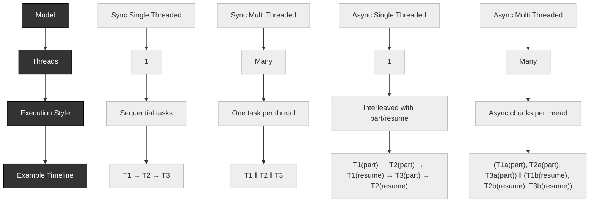

## Asynchronous Programming
- Do independent tasks in parallel 
- No waiting do something else
- Async programming soesnt means multithreading , but closely tied to it


### Async vs Multi-thread
- multithreading is one form of async programming
- Async programming can be done with single thread as well as multithreads
- multi - threading is about Workers works parallel
- Async is all about set of tasks to be finished , for example an app may have :
    Task 1: network 10pkts in Queue to be procssed
    Task 2: Timer Callback pending to execute
    Task 3: A network pkt to send to remote machine
    Task 4: A CLI input user to be processed
  here, an application has numbers of task to perform
- this program divides a piece of work into individual indipendent task and then execute those task in some order. 


# Execution Models Explained: Sum & Multiplication of an Array

We have an array of 10 integers and two tasks to perform:
- **Task 1**: Compute the sum of all numbers `sum[0..9]`
- **Task 2**: Compute the product of all numbers `mul[0..9]`

Below we explore four execution models: synchronous and asynchronous, in both single-threaded and multi-threaded environments.

| Concept                        | Definition |
|-------------------------------|------------|
| **Synchronous**               | Tasks execute one after another. The program waits for a task to finish before starting the next. |
| **Asynchronous**              | Execution doesn't block: a task can start and other work continues "while waiting" for its completion. |
| **Single-threaded**           | Only one thread of execution handles all tasks—can still be async, e.g., via event loops. |
| **Multi-threaded**            | Multiple threads run concurrently, often in parallel across CPU cores. |
---

## 1. Synchronous Single-Threaded
- Behavior: One thread, tasks run sequentially.
- Pseudo-code:
```cpp
#include <iostream>
using namespace std;

int main() {
    int arr[10] = {1,2,3,4,5,6,7,8,9,10};
    long long sum = 0;
    for(int i = 0; i < 10; i++) sum += arr[i];  // Task 1

    long long mul = 1;
    for(int i = 0; i < 10; i++) mul *= arr[i];  // Task 2

    cout << "Sum = " << sum << ", Mul = " << mul << endl;
}
````

* **Example Output:**

```
Sum = 55, Mul = 3628800
```

---

## 2. Synchronous Multi-Threaded

* Behavior: Two threads run tasks in parallel—no blocking or synchronization needed since tasks are read-only.
* Pseudo-code:

```cpp
#include <iostream>
#include <thread>
using namespace std;

int arr[10] = {1,2,3,4,5,6,7,8,9,10};
long long sum = 0, mul = 1;

void computeSum() { for(int i = 0; i < 10; i++) sum += arr[i]; }
void computeMul() { for(int i = 0; i < 10; i++) mul *= arr[i]; }

int main() {
    thread t1(computeSum), t2(computeMul);
    t1.join(); t2.join();
    cout << "Sum = " << sum << ", Mul = " << mul << endl;
}
```

* **Example Output:**

```
Sum = 55, Mul = 3628800
```

---

## 3. Asynchronous Single-Threaded

* Behavior: One thread, tasks broken into subtasks—task switching happens before completion.

### Pseudo-code:

```cpp
#include <iostream>
using namespace std;

int main() {
    int arr[10] = {1,2,3,4,5,6,7,8,9,10};
    long long sum = 0, mul = 1;

    // Subtask sequence (interleaved):
    for(int i = 0; i < 5; i++) sum += arr[i];  // sum part
    for(int i = 0; i < 5; i++) mul *= arr[i];  // mul part
    for(int i = 5; i < 10; i++) sum += arr[i]; // sum resume
    for(int i = 5; i < 10; i++) mul *= arr[i]; // mul resume

    cout << "Sum = " << sum << ", Mul = " << mul << endl;
}
```

---

## 4. Asynchronous Multi-Threaded

* Behavior: Multiple threads, tasks broken into parts and executed across threads asynchronously.

### Pseudo-code:

```cpp
#include <iostream>
#include <thread>
using namespace std;

int arr[10] = {1,2,3,4,5,6,7,8,9,10};
long long sum1 = 0, sum2 = 0, mul1 = 1, mul2 = 1;

void computeSum(int start, int end, long long &res) {
    for(int i = start; i < end; i++) res += arr[i];
}
void computeMul(int start, int end, long long &res) {
    for(int i = start; i < end; i++) res *= arr[i];
}

int main() {
    thread t1(computeSum, 0, 5, ref(sum1));
    thread t2(computeMul, 0, 5, ref(mul1));
    thread t3(computeSum, 5, 10, ref(sum2));
    thread t4(computeMul, 5, 10, ref(mul2));

    t1.join(); t2.join(); t3.join(); t4.join();

    long long totalSum = sum1 + sum2;
    long long totalMul = mul1 * mul2;
    cout << "Sum = " << totalSum << ", Mul = " << totalMul << endl;
}
```

* **Example Output:**

```
Sum = 55, Mul = 3628800
```

---

## Summary Table

| Model                 | Threads | Execution Style           | Example Flow                                    | Output                    |
| --------------------- | ------- | ------------------------- | ----------------------------------------------- | ------------------------- |
| Sync Single-Threaded  | 1       | Sequential                | `sum → mul`                                     | `Sum = 55, Mul = 3628800` |
| Sync Multi-Threaded   | 2       | Parallel tasks            | Thread1: sum, Thread2: mul                      | `Sum = 55, Mul = 3628800` |
| Async Single-Threaded | 1       | Interleaved (part/resume) | `sum part → mul part → sum resume → mul resume` | `Sum = 55, Mul = 3628800` |
| Async Multi-Threaded  | >1      | Parallel async subtasks   | Threads run sum/mul chunks independently        | `Sum = 55, Mul = 3628800` |

---

## Key Takeaways

* **Synchronization** determines the ordering of tasks—whether one waits for another.
* **Threading** determines how many execution workers (threads) exist.
* Asynchronous behavior is about non-blocking execution and can occur regardless of threading model.
* Practical choice depends on task type: use async for I/O-bound operations; use multi-threading for CPU-bound workloads.
---

# Event Loop: Data Structure & Execution Cycle

The **event loop** is a concurrency model that continuously processes tasks from a queue and suspends when no tasks are available. It ensures non-blocking execution by serializing queued jobs.  

The application acts as a **producer**, enqueuing jobs. The event loop thread is the **consumer**, executing them sequentially.

---

## 1. Core Components

- **Event Loop Thread**  
  - Runs indefinitely, suspending when idle.  
  - Never terminates, always ready to resume when tasks exist.  

- **Task Queue**  
  - A FIFO structure (can be implemented with a linked list).  
  - Holds pending computations (functions and arguments).  

- **Event Loop = Thread + Task Queue**  
  ```text
  eventLoop = thread + taskQueue
````

* **Interaction**

  * Application threads submit new jobs (producers).
  * Event loop consumes and executes tasks one by one.

---

## 2. Execution Lifecycle

1. **Idle** — No tasks, event loop suspended.
2. **Task Submission** — Application enqueues a new job `(fnX, argX)`.
3. **Wake Up** — Event loop thread resumes execution.
4. **Process Queue**

   * While the queue is not empty:

     * Dequeue a task.
     * Execute it.
5. **Suspend Again** — Once the queue is empty, event loop returns to idle.

---

## 3. Concurrency Safety

* Multiple threads may enqueue tasks concurrently.
* Enqueue (push) and dequeue (pop) operations must be **thread-safe**.
* Synchronization is required using **mutexes** or thread-safe queue implementations.

---

## 4. Example: Event Loop in Pseudocode

```cpp
#include <iostream>
#include <queue>
#include <thread>
#include <mutex>
#include <condition_variable>
#include <functional>

class EventLoop {
private:
    std::queue<std::function<void()>> taskQueue;
    std::mutex mtx;
    std::condition_variable cv;
    bool running = true;

public:
    // Submit a new job to the event loop
    void enqueueTask(std::function<void()> task) {
        {
            std::lock_guard<std::mutex> lock(mtx);
            taskQueue.push(task);
        }
        cv.notify_one(); // Wake up the event loop
    }

    // The core loop
    void run() {
        while (running) {
            std::function<void()> task;
            {
                std::unique_lock<std::mutex> lock(mtx);

                // Wait until a task is available
                cv.wait(lock, [&] { return !taskQueue.empty() || !running; });

                if (!running && taskQueue.empty()) break;

                task = taskQueue.front();
                taskQueue.pop();
            }
            task(); // Execute task
        }
    }

    // Stop the event loop gracefully
    void stop() {
        {
            std::lock_guard<std::mutex> lock(mtx);
            running = false;
        }
        cv.notify_all();
    }
};

// Example usage
int main() {
    EventLoop loop;

    // Start event loop in background thread
    std::thread loopThread([&] { loop.run(); });

    // Application threads submitting jobs
    loop.enqueueTask([] { std::cout << "Task 1 executed\n"; });
    loop.enqueueTask([] { std::cout << "Task 2 executed\n"; });

    // Stop after a delay
    std::this_thread::sleep_for(std::chrono::seconds(1));
    loop.stop();

    loopThread.join();
    return 0;
}
```

---

## 5. Summary Table

| Component / Concept     | Role / Description                                  |
| ----------------------- | --------------------------------------------------- |
| **Event Loop Thread**   | Runs infinite loop, suspends when idle              |
| **Task Queue**          | FIFO structure holding jobs (e.g., linked list)     |
| **Application Threads** | Submit tasks to the queue (producers)               |
| **Synchronization**     | Ensures atomic enqueue/dequeue to prevent conflicts |

# Serializing Multithreaded Flows

In a multithreaded application, multiple threads may run **concurrently**, often working on shared data structures. This leads to two important concepts:

---

## 1. Overlapping Work

- **Definition**: Work `W1` by thread `T1` and work `W2` by thread `T2` are said to be **overlapping** if both operate on the same data.  
- **Example**:  
  - `T1` sorts array `A` in ascending order.  
  - `T2` sorts array `A` in descending order.  
  - Since both threads access the same array `A`, their work overlaps.  

- **Non-overlapping Work**:  
  If `T1` sorts `A1` and `T2` sorts `A2` (two different arrays), no overlap occurs.

---

## 2. Thread Synchronization

When overlapping occurs (shared data access), **synchronization mechanisms** (mutexes, semaphores, condition variables) are needed to:

- Prevent **race conditions**.  
- Ensure **data consistency**.  
- Avoid **undefined behavior** when two threads modify the same data simultaneously.  

If threads operate on **independent, isolated data structures**, synchronization is not needed, and concurrency scales better.

---

## 3. Is Multithreading Superior to Single Threading?

- **Not always.**  
  - **Single-threaded**:  
    - Simpler design.  
    - No need for synchronization.  
    - Works well for small workloads or when tasks are inherently sequential.  
  - **Multi-threaded**:  
    - Better performance only if tasks can be parallelized without much overlap.  
    - Introduces complexity: synchronization, deadlocks, context-switch overhead.  

**Rule of Thumb**:  
> The more **isolated data structures** and **independent responsibilities** your application has, the more it benefits from multithreading.  

---

## 4. Choosing Between Single vs. Multi-threaded

| Case                                  | Better Choice         |
|---------------------------------------|-----------------------|
| Tasks are **sequential** or **dependent** | **Single-threaded**   |
| Heavy overlap on shared data           | **Single-threaded** (serialization avoids complexity) |
| Independent tasks on isolated data     | **Multi-threaded**    |
| CPU-bound heavy computation            | **Multi-threaded**    |
| IO-bound tasks (waiting for events)    | **Event loop + listener threads** |

---

## 5. Listener Threads

- Many applications need to **listen for external events** (e.g., network packets, sensor signals, user inputs).  
- These events can arrive **at any time**.  
- A **listener thread** is dedicated to continuously waiting for such events.  
- On receiving an event, the listener queues the event into the **Event Loop (EL)**.  

### Why not single-threaded?
- A single-threaded design would block waiting for input, preventing the program from doing other work.  
- Using listener threads (or timer threads), the application can **react to events asynchronously** by feeding them into the **event loop**.

---

## 6. Summary

- Overlapping work requires synchronization.  
- Multithreading ≠ always faster (overhead may cancel benefits).  
- Best performance is achieved when threads operate on **isolated, independent tasks**.  
- For reactive systems, **listener threads** + **event loop** provide an efficient design.  

# Serializing Timers in Asynchronous Programming

## 1. Role of Timers
Timers are one of the most important building blocks in asynchronous programming.  
They enable **timer-driven execution**, where tasks are scheduled to run:

- **One-shot**: executed once after a given delay.  
- **Periodic**: executed repeatedly at fixed intervals.  

This allows the application to defer or repeat work **without blocking the main thread**.

---

## 2. Scheduling with Timers
A timer schedules **future computation** by registering a callback function and an expiry time.  
When the timer expires, the callback is queued into the **Event Loop** (or task array), to be executed by the event loop thread.

- **One-shot timer**: Fires once, executes callback, then stops.  
- **Periodic timer**: Fires repeatedly until explicitly cancelled.

---

## 3. POSIX Timers
In systems programming, **POSIX timers** (`timer_create`, `timer_settime`, etc.) provide a standardized API to manage timers.  
They can deliver expiration events via:

- **Signals** (traditional approach).  
- **File descriptors** (`timerfd_*` APIs in Linux).  

This allows timers to be integrated into event loops just like sockets or file I/O.

---

## 4. Timer Serialization
When multiple timers expire:

- The event loop **serializes** them by placing their callbacks into the **task queue** in order of arrival.  
- Even though timers may conceptually fire "at the same time," they are **discharged one by one** by the event loop thread.  
- This ensures deterministic execution order (no two timer callbacks run simultaneously on the same event loop thread).

---

## 5. Example Use-Cases
- **One-shot timer**:  
  Retry a network connection after 5 seconds.  
- **Periodic timer**:  
  Trigger a heartbeat message every 1 second.  
- **Timeout handling**:  
  Cancel an operation if it does not complete within a given time window.  

---

## 6. Example (POSIX Timer + Event Loop Pseudocode)

```c
// Create a POSIX timer
timer_t t;
struct sigevent sev = {0};
sev.sigev_notify = SIGEV_THREAD;  // Notify via callback thread
sev.sigev_notify_function = my_timer_callback;

timer_create(CLOCK_REALTIME, &sev, &t);

// Set timer to fire every 1 second
struct itimerspec its;
its.it_value.tv_sec = 1;     // first expiry
its.it_value.tv_nsec = 0;
its.it_interval.tv_sec = 1;  // periodic interval
its.it_interval.tv_nsec = 0;

timer_settime(t, 0, &its, NULL);

// Callback (executed asynchronously)
void my_timer_callback(union sigval sv) {
    enqueue_task(event_loop, heartbeat_fn); // serialize into event loop
}

