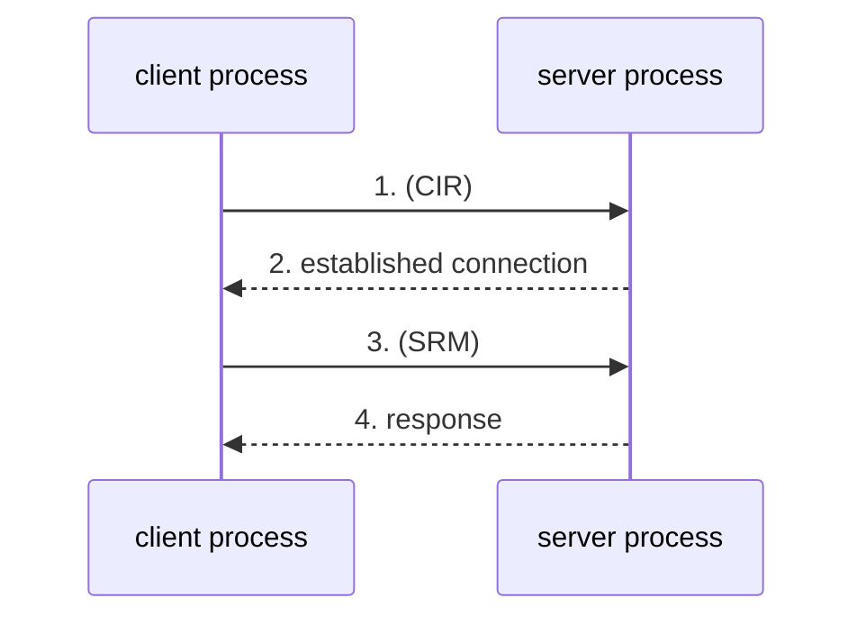
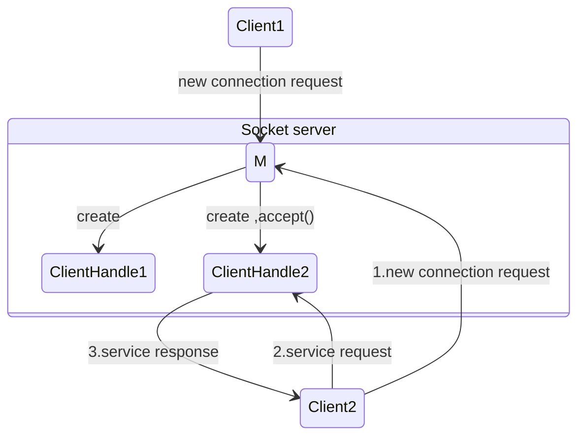
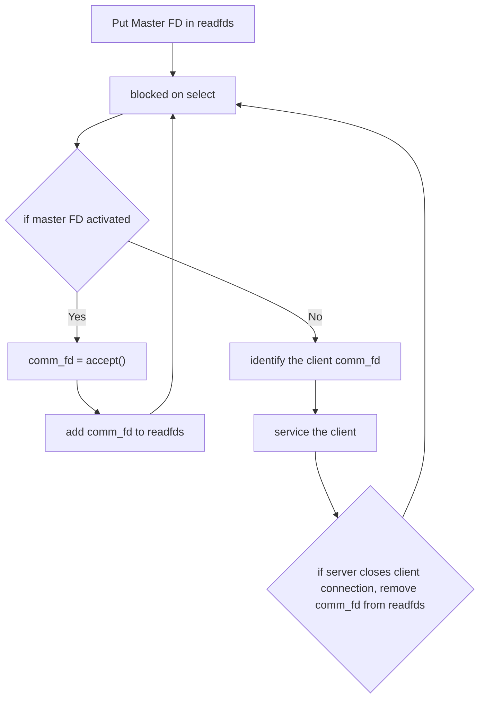

## Sockets

- **Socket interface**: A collection of socket-programming-related APIs.
- **Socket types**:
  - **Unix-domain sockets**: For communication between processes on the same machine.
  - **Network sockets**: For communication between processes on different physical machines over a network.

### Steps (for Unix-domain socket server):

1. Remove existing socket file, if already present.
2. Create a Unix socket using `socket()`.
3. Specify the socket name (a file path).
4. Bind the socket using `bind()`.
5. Call `listen()` to start listening for incoming connections.
6. Use `accept()` to accept a client connection.
7. Read data received on the socket using `recvfrom()`.
8. Send back the result using `sendto()`.
9. Close the data socket.
10. Close the connection (master) socket.
11. Remove the socket file.
12. Exit the process.

- System calls interface with the socket APIs.
  
### Socket Message Types

1. **Connection Initiation Request (CIR)**
   - This message is used by the *client process* to request the *server process* to establish a dedicated connection.
   - Only after the connection has been established can the client send a **Service Request Message (SRM)** to the server.

2. **Service Request Message (SRM)**
   - The client can send this message to the server once the connection is fully established.
   - Through this message, the client requests the server to provide a specific service (functionality).

> **Note**: The server identifies and processes both types of messages.

#### Message Flow Diagram:

- **Example**:  
  - The client sends two numbers `(a, b)` to the server.
  - The server performs `a × b` and sends back the result.
  - The SRM is the pair `(a, b)` generated by the client process.
  - Once the server receives the SRM, it performs the computation and responds with the result.

---

## Socket Design

### State Machine of Socket-Based Client-Server Communication

#### Server Design:

1. When the server boots up (i.e., when the server process is started), it creates a **connection socket** (also called the **master socket file descriptor**) using the `socket()` system call.

> **Note**: Once the client sends a CIR, the OS routes it to the master socket file descriptor.

2. As soon as the server receives a new connection request from a client, it creates a **client handle (identifier)** using the master socket descriptor.
   - There will be as many handles as clients.
   - The server maintains a database of client handles, which correspond to connected clients.

> **Note**:  
> - Master socket `M` is the origin of all client handles.  
> - Client handles are also called **data sockets**  
> - `M` only creates client handles. It does **not** process service requests or exchange data with connected clients.

3. Once a client successfully establishes a connection with the server, they are in a position to send SRMs to the server.
   - When the OS receives an SRM from a connected client, it routes the message to the **specific client handle**.
   - The server reads, processes the request, and sends a response.

> **Note**:  
> - The purpose of the **master socket** is solely to create client handles.
> - It is **not** used for data exchange or to process SRMs.
> - That’s the job of **client handles** or **data sockets**.

4. The server creates client handles using the `accept()` system call.
   - Argument to `accept()` is the **master socket descriptor**.
   - The **goal of `accept()`**:
     - Complete the connection establishment.
     - Create a client handle.
     - accept is not for connectionless communication.

> **Note**:  
> - Handles are file descriptors (integers in Linux).
> - Client handles = communication file descriptors = data sockets.  
> - `M` = master socket file descriptor = connection socket.

## UNIX Domain Sockets
- Unix Domain Sockets are used for carrying out IPC between two processes running on "Same" machine
- Server process is process which waits for request from client process 
- using UNIX domain sockets , we can setup STREAM Or DATAGRAM based communication 
  - STREAM - when large files need to be moved or copied from onelocation to another, eg: copying a movie
    ex: continuous flow of bytes , like water flow
  - DATAGRAM - when small units of data needs to be moved from one process to another within system.

  

### steps (server)
 1. remove socket, if already exists
 2. create a unix socket using 'socket()' also known as master socket File discriptor or connection socket
 3. bind socket using 'bind()' system call 
 4. 'listen()'
 5. 'accept()' in order to wait for the connection from new client
 6. once the "client connection request" arrives using 'connect()' system call , the server process gets unblocked from the accept system call and then after that server and client process are actually engaged in communication(ie,exchanging data)
 7. Read te data recived on socket using 'read()'
 8. send back the result using write()
 9. close the data socket 
 10. close the connection socket
 11. remove the socket 
 12. exit

## Multiplexing
- Multiplexing is a mechanism through which server process can monitor multiple client at same time
- Without Multiplexing , server process can entertain only one client at a time, and cannot entertain other clients requests until it finishes with the current client.
- with multiplexing, server can entertain multiple connected clients simultaneously
   - No Multiplexing : is euavelent  to situation where the current client is served by server,client has to join the queue right from last (has to send a fresh connection request) to get another service from server.
   - multiplexing : server can service multiple clients at the smae time (multitasking?),linux provides special system call to develop multiplexed communication that system call is 'select()'.
- 'select()' system call helps us to monitor all clients activity at the same time ,these are those clients which are connected to our server , monitors like which client has send the data , and which has not sent a data, and which client has sent  new connection initiation request.
  - server process has to maintain client handles (communication FDs) to carry out communication (data exchange) with connected clients.(cleint handles one or more  are maintained by server).
  - In addition, server-process has to maintain connection socket or master socket FD as well(M) to process new connection req from new clients.
  - linux provides an inbuilt DataStructure to maintain the set(collection) of sockets file discriptors (server maintains FDs one is master FD and communication file discriptors as seen in diagram earlier)
  - the datastructure is 'fd_set' , its a set of filediscriptors  which are maintained by server at anypoint of time , so "select()" monitors all socket FDs present in "fd_set"
  - hence , selec() operates on set of FDs maintained by server, the argument for 'select()' is 'fd_set' which contains some set of FDs
  - 'select()' is a blocking system call , 'select()' unblocks when 'New connection request from new client arrives' or 'Data request from existing connected client arrives'
  - when server unblocks from the select() call it has to identify why it as been unblocked , server needs to check whether its new connection req or new data req on existing connection. in the later case , server need to find which client has send the data

  

