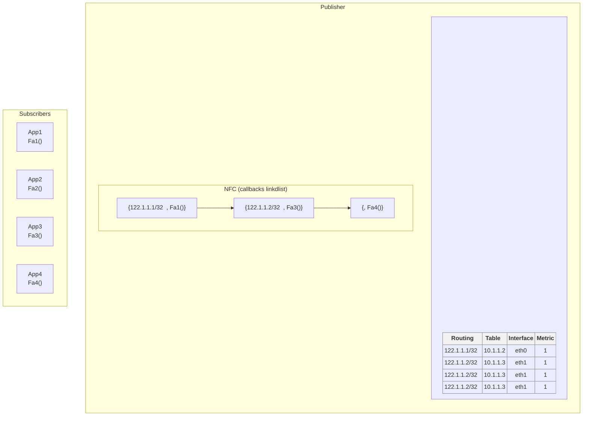
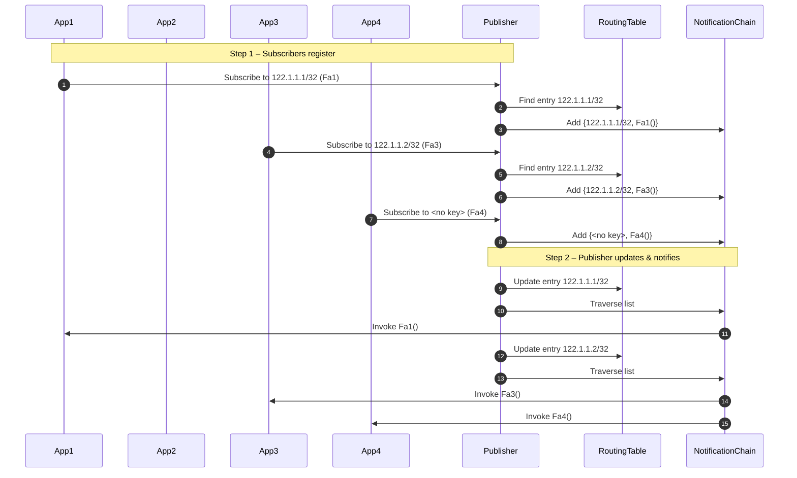

# Multithreading Concepts

## 1. Thread Termination

- Thread function returns
- `pthread_exit(0);`
- Thread cancellation

> **Note:** Threads are siblings — there is no parent-child relationship.  
> If a parent thread dies, it has absolutely no impact on the others.  
> Each thread has its own lifecycle.

### Exception:
- When the **main thread** of a process terminates, **all other threads** in the process are also terminated.
- The reverse is **not** true: terminating another thread does **not** terminate the main thread.

```c
// Example:
return 0;           // Terminates main and all threads.
pthread_exit(0);    // Keeps other threads alive.

```

----------

## 2. Multiple Threads Share the Same Virtual Address Space

-   Resources allocated by one thread are visible to all other threads.
    
-   Shared resources among threads in the same process:
    
    -   **Heap memory**
        
    -   **Sockets**
        
    -   **File descriptors**
        
    -   **Global variables**
        

> All of the above are part of the **shared memory space** of the process, accessible by every thread.
> Threads do not share is the **stack memory**,every thread has its own stack memory

Great question. Let's break it down:

----------

## Virtual Address Space vs. Paging (in context of Multithreading)

### 🔹 Virtual Address Space

All threads **in a process** share the **same virtual address space**. This means:

-   Same code section (text)
    
-   Same heap
    
-   Same global/static variables
    
-   Same file descriptors
    
-   Same stack **layout** (but each thread has its **own stack memory** within that space)
    

So when one thread allocates memory dynamically (`malloc`), it's visible to all threads.

----------

### 🔹 What About Paging?

Paging is handled by the **operating system's memory management unit (MMU)** and is **not affected** by how many threads exist.

Here's how it works:

1.  **Virtual memory** is divided into pages (commonly 4KB each).
    
2.  Each virtual address is mapped to a physical address using **page tables**.
    
3.  This mapping is **per-process**, not per-thread.
    

> Even though multiple threads exist, they all operate within the same process context, so they share the **same page table**.


### 🔹 So What Happens to Paging in Multithreading?

**Nothing special changes in paging** due to multithreading:

-   The OS maintains a single page table for the process.
    
-   All threads access memory using this shared virtual address space.
    
-   The hardware (MMU + TLB) ensures the translation is fast and isolated from other processes.
    

----------

### 🔍 Example:

```c
void *thread_fn(void *arg) {
    int *p = malloc(sizeof(int));  // Allocated on heap
    *p = 42;
    printf("Pointer value: %d\n", *p);
    return NULL;
}

```

Here, `p` is allocated in the **heap** (shared virtual memory region). If another thread is passed `p`, it can access/modify the value too — because **they share the same address space and page mappings**.

----------

## 3. Scheduling threads
> **Remember:** A thread represents the execution flow.

---

### ❓ Q: What is scheduled — Thread or Process?

🅰️ The **Kernel (OS)** does **not schedule processes** — it schedules **threads**.

- A **thread** is the actual **schedulable entity**, not a process.
- **Scheduling** means how the OS decides **which thread** gets **which CPU** for execution.

---

### ⚠️ Exceptions / Violations

> Though threads are scheduled individually, certain OS-level behaviors treat the process as a whole.

1. **Segmentation Fault (Segfault):**
   - If **any thread** segfaults, the **entire process is terminated**, including all its threads.

2. **Signals:**
   - Signals like `SIGSEGV`, `SIGTERM` are delivered **per process**, not per thread.

---

### ⚔️ Race Condition on Thread Creation

- A **race condition** can occur during thread creation because the **kernel decides which thread (parent or child)** is given the CPU **first** after the `pthread_create()` call.
- This **non-determinism** can affect execution order and behavior.

---

### ⚙️ CPU Scheduling Across Cores

- The **kernel schedules threads** on **multiple CPUs**.
- The scheduling follows **policies** like:
  - **FCFS** (First Come First Serve)
  - **SJF** (Shortest Job First)
  - And other policies, depending on the OS configuration and scheduler (e.g., CFS in Linux).


## 4. concurrency and parallelism

## Singularism – One Task at a Time
In **singularism**, only one task runs at a time — the next starts only after the first finishes.

### 💡 Code Example:
```c
#include <stdio.h>

void taskA() {
    for (int i = 0; i < 5; i++) {
        printf("Task A iteration %d\n", i);
    }
}

void taskB() {
    for (int i = 0; i < 5; i++) {
        printf("Task B iteration %d\n", i);
    }
}

int main() {
    taskA();  // Runs completely
    taskB();  // Starts only after taskA finishes
    return 0;
}
```

---

## 🔁 Concurrency – Task Switching on Single Core

In **concurrency**, tasks share a single core by switching — creating an illusion of parallelism.

### ✅ Behavior:
- OS/RTOS preempts running tasks to give others CPU time.
- Each task makes partial progress.
- Improves responsiveness (e.g., user input, I/O wait).

### 💡 Code Example:
```c
#include <stdio.h>

void taskA() {
    static int countA = 0;
    if (countA < 5) {
        printf("Task A iteration %d\n", countA++);
    }
}

void taskB() {
    static int countB = 0;
    if (countB < 5) {
        printf("Task B iteration %d\n", countB++);
    }
}

int main() {
    for (int i = 0; i < 10; i++) {
        taskA();  // Resume A
        taskB();  // Resume B
    }
    return 0;
}
```

---

## ⚡ Parallelism – True Simultaneous Execution

In **parallelism**, tasks run at the same time on separate cores.

### ✅ Behavior:
- Tasks don’t block each other.
- Needs multiple cores/threads.

### 💡 Code Example (POSIX Threads):
```c
#include <pthread.h>
#include <stdio.h>

void* taskA(void* arg) {
    for (int i = 0; i < 5; i++) {
        printf("Task A iteration %d\n", i);
    }
    return NULL;
}

void* taskB(void* arg) {
    for (int i = 0; i < 5; i++) {
        printf("Task B iteration %d\n", i);
    }
    return NULL;
}

int main() {
    pthread_t threadA, threadB;

    pthread_create(&threadA, NULL, taskA, NULL);
    pthread_create(&threadB, NULL, taskB, NULL);

    pthread_join(threadA, NULL);
    pthread_join(threadB, NULL);

    return 0;
}
```

---

## ⏱ Execution Timing Comparison – Gantt Chart

```mermaid
gantt
    title Task Execution Time Comparison
    dateFormat  HH:mm:ss
    axisFormat  %S sec

    section Singularism
    Task A       :done,  a1, 00:00:00, 3s
    Task B       :done,  a2, 00:00:03, 3s

    section Concurrency (Simulated on Single Core)
    Task A (slice 1) :done, c1, 00:00:00, 1s
    Task B (slice 1) :done, c2, 00:00:01, 1s
    Task A (slice 2) :done, c3, 00:00:02, 1s
    Task B (slice 2) :done, c4, 00:00:03, 1s
    Task A (slice 3) :done, c5, 00:00:04, 1s
    Task B (slice 3) :done, c6, 00:00:05, 1s

    section Parallelism
    Task A       :done, p1, 00:00:00, 3s
    Task B       :done, p2, 00:00:00, 3s
```



---

## 🛠 Embedded RTOS-style (FreeRTOS) Code Example

```c
void vTaskA(void *pvParameters) {
    while (1) {
        printf("Task A running\n");
        vTaskDelay(100 / portTICK_PERIOD_MS);  // Yield
    }
}

void vTaskB(void *pvParameters) {
    while (1) {
        printf("Task B running\n");
        vTaskDelay(100 / portTICK_PERIOD_MS);  // Yield
    }
}

int main(void) {
    xTaskCreate(vTaskA, "TaskA", 1000, NULL, 1, NULL);
    xTaskCreate(vTaskB, "TaskB", 1000, NULL, 1, NULL);
    vTaskStartScheduler();  // FreeRTOS starts task switching
}
```

---
## ⏱ Time & Resource Comparison

| Model        | Execution Style     | Speed     | Hardware         | Use Case                    |
|--------------|----------------------|-----------|------------------|-----------------------------|
| Singularism  | One at a time        | Moderate  | Any              | Simple embedded systems     |
| Concurrency  | Task switching       | Slower    | Single-core OK   | RTOS, multitasking systems  |
| Parallelism  | True simultaneous    | Fastest   | Multi-core CPU   | HPC, servers, real threads  |
---


---
### communication between threads (Exchange of data)
- IPC techniques are usually used to setup data exchange b/n processes and technically nothing  is stopping you from using it for threads.
- interthread communication , IPC techniques is not recommended way for data exchange 
- Communication between threds is preferred through callbacks/fn pointers bcz
  - very fast 
  - no actual transfer of data
  - "transfer of computation"
  - no attention req from kernel , completely run in user space
  - no kernel resourse explisitly created

---
### Publisher Subscriber Model
- Transfer of computaion(TOC) model leads to architectural communication model
- also known as Notification chain(PUB-SUB model)
- this is Pattern of communication which is based on Transfer of communication
- the thread which generates the data is called publisher 
- the thread which owns the data processing function is called subscriber
- the activity of TOC is called Callback registeration
- the activity of invoking the function through fn pointer by publisher is called "Notification"


### Notification Chains(NFC) 
- Notify the subscribers about the events!
- Notification chains is an architectural concept(design pattern) used to notify multiple subscribers in the particular event
- Aparty which generates an event is callled publisher and parties which are interested in beieng notified of the event are called subscribers
- there are one publisher and multiple subscriber 
- once the evvent is generated/produced by publisher the event is pushed to subscriber
- subscriber can register and deregister for the event at their will
- Publisher/Subscribers could be any entities
   - multiple threads of the same process
   - multiple processes running on same system
   - multiple processes running on defferent systems
   - Different components of the same big software system 




### Components in the Model

### Publisher
- **Holds a Routing Table** — list of routes and associated data like interface and metric.
- **Maintains a Notification Chain** — linked list of subscriber callbacks.

### Subscribers (Apps)
- Want to receive updates for specific routing keys (e.g., `122.1.1.1/32`) or for all updates (`<no key>`).

---

### Step 1 – Subscription Phase

A subscriber registers with the Publisher by specifying:
- **Key** → which route or event they care about.
- **Callback Function** → function to be called when the key changes.

**Example (from sequence diagram):**
- **App1** subscribes to `122.1.1.1/32` → Publisher finds it in the Routing Table → adds `{122.1.1.1/32, Fa1()}` to the Notification Chain.
- **App3** subscribes to `122.1.1.2/32` → added as `{122.1.1.2/32, Fa3()}`.
- **App4** subscribes to `<no key>` → gets `{<no key>, Fa4()}` meaning “notify me on any update”.

---

### Step 2 – Publish / Notification Phase

When the Publisher updates the Routing Table:
1. Finds the updated key (e.g., `122.1.1.1/32`).
2. Traverses the Notification Chain.
3. Calls the callback functions of all subscribers interested in that key.

**Example:**
- Publisher updates `122.1.1.1/32` → finds `{122.1.1.1/32, Fa1()}` → invokes `Fa1()` in **App1**.
- Publisher updates `122.1.1.2/32` → triggers `Fa3()` in **App3** and `Fa4()` in **App4** (since `<no key>` matches all).

---

### Pub–Sub Principle at Work

- **Loose Coupling** → Publisher doesn’t know subscriber internals; it just calls registered callbacks.
- **Scalability** → New subscribers can join without changing Publisher logic.
- **Event-driven** → Subscribers only get notified when relevant events happen (matching key or wildcard).

### NFC-Publisher subscriber model
- setting up the data source/Publisher/subscriber
<p align="center">
  
</p> 

### notification subscription mechanism
- allow subscribers to subscribe or (un)subscribe for the entry of interest for notifications
- Notify Subscribers whenever the entry in the data source is updated by the publisher
- from below diagram as you see publisher is un-aware of presence of subscribers , all publisher does is to update the data source
- its the data source which is aware of subscribers
<p align="center">
  
</p> 


### notification and subscription process 
- 
<p align="center">
  
</p> 

